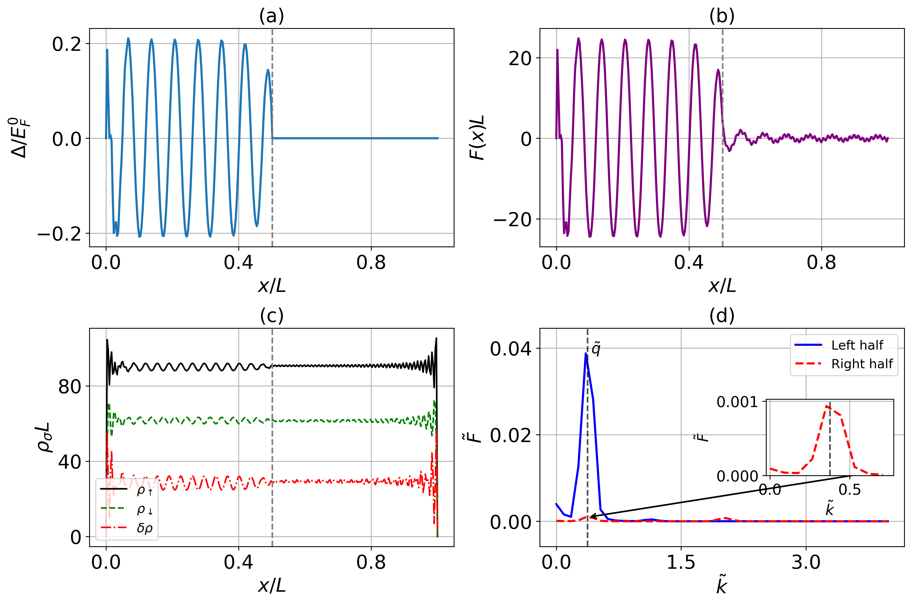

# BdG Interface Solver

## Overview
This project implements a self-consistent Bogoliubov-de Gennes (BdG) solver for one-dimensional inhomogeneous fermionic systems with spatially varying interaction strength and Zeeman field.

The code uses a finite-difference discretization with hard-wall boundary conditions, iteratively solves the BdG equations, and computes observables such as:
- pairing field
- pair correlation
- spin densities
- magnetization
- momentum-space pair correlations

## Features
- 1D finite-difference BdG solver
- self-consistent gap update with mixing
- spatially varying interaction and field profiles
- automatic saving of results in `.npz` format
- built-in plotting for real-space and momentum-space observables

## Methods
- finite-difference discretization
- matrix diagonalization using SciPy
- iterative self-consistent convergence
- Fourier analysis of pair correlations

## Requirements
- Python 3
- NumPy
- SciPy
- Matplotlib

## Example output
The code produces:
- pairing field profiles
- pair correlation profiles
- spin-resolved density profiles
- Fourier spectrum of pair correlations
- local magnetization

## Relevance
This project demonstrates:
- computational modeling
- numerical linear algebra
- iterative solvers
- data analysis and visualization
- parameter-dependent simulation of complex physical systems
